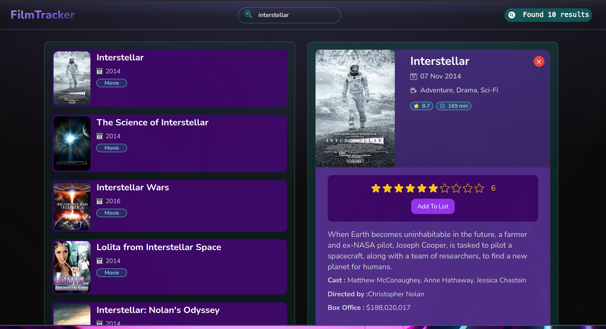

# Film Tracker App

### [LIVE DEMO](https://film-tracker-app.netlify.app/)



# Description
<div>
<div align="center">


  
  


</div>

# Run Project
### 1. Clone the project

### 2. Run the project
```shell
npm i
npm run dev
```

### 3. Build
```shell
npm run build
```
